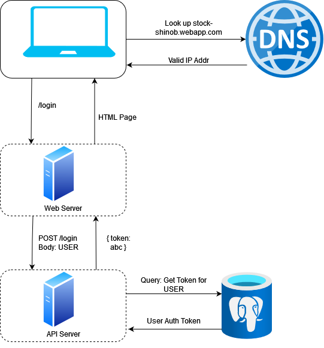
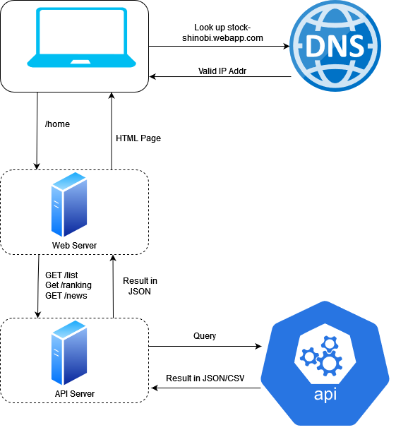

## **Design**

### Diagrams:

**Login Query:**

**Home Page Query:**

### **Impact of Design Decisions:**

- Scalability: The microservices architecture and deployment on GCP ensure our application can handle growing user loads
  without compromising performance.

- Maintainability: Modular code and well-defined relationships ease maintenance tasks, enabling seamless updates and bug
  fixes.

- Security: Token authentication and secure communication protocols safeguard user data, enhancing the overall
  trustworthiness of the platform.

- User Experience: The intuitive design and seamless interactions contribute to a positive and engaging user experience,
  promoting user retention and satisfaction.